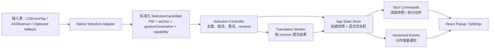

# 鼠标划词可靠性专项修复规划（2026-07-19）

> 状态：执行中（Active）  
> 启动日期：2026-07-19（Asia/Shanghai）  
> 启动原因：桌面端鼠标划词监听无法稳定工作，划词弹层及整体前端交互存在系统性缺陷。  
> 执行约束：本文件是本次专项任务的唯一执行基线。后续设计、开发、测试、审查与验收必须映射到本文件中的工作包和验收条目；不得静默扩大范围或偏离目标。

## 0. 当前唯一闭环（2026-07-20 纠偏）

在自动化曾经全绿、但用户真实操作仍失败后，本专项暂停文档扩写、发布、多屏与非相关重构。Preview/PDF 已于 2026-07-20 由用户物理鼠标实测通过；当前只保留一个尚未闭环的 Chrome 阻断点，并继续守住已修复的本地凭据路径：

1. **本地签名包的 Keychain 根因**：无 Team ID 的本地签名身份不能稳定满足登录钥匙串 ACL/分区身份；即使系统辅助功能与输入监听已经授权，翻译热路径读取 API Key 仍会触发登录密码框。修复要求是本地构建在编译期完全绕过 Keychain，使用权限为 `0600`、拒绝符号链接/多硬链接的当前用户私有文件；Developer ID 正式构建才保留 Keychain 路径。不得自动读取或迁移旧钥匙串条目。
2. **Chrome 当前根因**：用户最新失败现场为 `anchored_target_not_frontmost`，同时 `candidates=0`、`duration=0 ms`。这证明程序在读取网页选区前就把 Chrome 的事件目标 PID 与 AX 元素/窗口所属应用 PID 当成同一个稳定身份并提前拒绝；不是翻译接口失败，也没有证据表明 Chrome 返回了空文本。修复要求是 mouse-down 以鼠标锚点命中的 AX owner PID 作为更强的应用身份，mouse-up 继续用锚点元素、窗口和前台应用复验，再走 Chromium 已公开支持的 `AXSelectedText` / selected-range 路径。独立审查已否决自动发送 Cmd+C 的草案：仅凭 pasteboard `changeCount` 无法可靠区分本程序复制、用户复制和剪贴板管理器更新，存在误翻译及覆盖用户新剪贴板的风险。因此当前版本不得自动改写剪贴板；用户主动 Cmd+C+C 仍是相互独立的只读兜底。

本闭环只有在下列顺序全部完成后才能标记结束：Chrome 定向测试通过 → 独立审查按六方面批准 → 构建并启动唯一新制品 → 用户在固定 Chrome 网页文本上确认“拖选弹窗成功、原剪贴板不变且 Cmd+C+C 不要求密码”。Preview 已通过但不能替代 Chrome 的最后一步；自动化绿色也不得替代用户实测。

**2026-07-20 当前检查点**：唯一运行副本仍是 `/Applications/Paper Float Translator.app`（上一安装包 CDHash `411b34018125e36b6f550162b726c1ec8a4b0752`）；本地构建已在编译期排除 Keychain。用户已确认 Preview 可用，Chrome 失败现场已收敛到读前身份误判。本轮代码已改为 AX 锚点 owner PID 归一化；曾实现的 Chrome 自动复制草案因独立审查发现剪贴板并发归因与恢复风险而已完整移除。当前状态仍为 **Active**，正在执行自动验证、独立复审、重新安装和 Chrome 用户实测，任何旧 CDHash 或 Preview 成功均不得被写成 Chrome 已修复。

## 1. 任务目标

本专项要把“划词 → 获取文本 → 显示弹层 → 发起翻译 → 展示结果 → 关闭或继续操作”修复为可解释、可测试、可恢复的完整链路，而不是只让某一个演示场景偶然成功。

完成后必须满足：

1. 用户在受支持应用中以鼠标拖选、双击选词、三击选段、Shift 扩选或键盘选区后，应用能在能力允许时可靠识别选区。
2. 权限缺失、应用不支持辅助功能取词、事件监听失效、剪贴板回退不可用等情况，都能被明确区分并给出正确操作入口。
3. 同一文本可被重复选择；连续快速选择时，旧任务不得污染新任务。
4. 弹层在多显示器、负坐标、不同缩放比例和屏幕边缘场景下位置与尺寸正确，不截断、不跳屏。
5. 前端展示的是当前真实状态；设置项保存状态、权限状态、错误与恢复动作不存在误导。
6. 真实签名身份、macOS 权限、原生监听、Rust 控制层、Tauri IPC 和 React UI 均有相应验证证据。

## 2. 范围与非目标

### 2.1 本次范围

- macOS 桌面端选区监听与辅助功能读取。
- 鼠标、键盘和辅助功能通知共同构成的选区事件源。
- 权限探测、监听健康状态、能力降级与恢复。
- 原生桥接、Rust 状态机、Tauri 命令/事件协议。
- 划词弹层、翻译过程、设置页和后台运行交互。
- 多显示器、高 DPI、窗口尺寸与定位。
- 单元、集成、前端 UI、原生和真实运行验收。
- 构建可复现性、应用身份稳定性以及 TCC 权限验证。

### 2.2 非目标

- 本轮不重做翻译模型本身，不改变 DeepSeek API 的业务语义，除非为消除竞态或错误处理所必需。
- 本轮不无条件承诺所有第三方应用都能通过 macOS Accessibility API 读取文本。对浏览器特殊页面、PDF.js、Canvas 等场景，应明确能力边界；若基础 AX 方案无法满足核心验收，再按本计划的变更控制启用 DOM/浏览器扩展适配工作包。
- 本轮不进行与划词可靠性、弹层交互或桌面生命周期无关的视觉品牌重构。

## 3. 已确认问题与根因基线

以下条目来自 2026-07-19 的代码、构建和运行审查，是实施时必须逐项关闭的基线。严重度定义：P0 = 阻断主链路；P1 = 高频错误或数据/状态污染；P2 = 明显体验或维护性问题。

| ID | 严重度 | 已确认问题 | 根因 | 目标工作包 |
| --- | --- | --- | --- | --- |
| RC-01 | P0 | 系统权限不足时，设置页可能不给出正确入口 | Rust 已兼容部分拒绝字符串，但原生启动路径不发出前端 CTA 可识别的拒绝状态；前端仍用单一状态字符串推测多个独立能力 | WP1、WP4 |
| RC-02 | P0 | 双击、三击、Shift/键盘选区无法稳定触发 | 当前主路径依赖“鼠标移动距离 ≥ 4”的拖拽判定；AXObserver 又与鼠标监听互斥 | WP2 |
| RC-03 | P0 | 再次选择相同文本不触发 | 原生全局永久去重与 Rust 再次抑制叠加，去重生命周期没有以一次手势/修订号为边界 | WP2、WP3 |
| RC-04 | P0 | 取到错误位置或错误应用中的文本 | AX 命中测试混用 `NSEvent.mouseLocation` 与 AX 顶部原点坐标；多屏转换以单一 `screenMaxY - y` 计算 | WP2、WP3 |
| RC-05 | P1 | 鼠标松开后移动会导致重试读取错误对象 | 延迟重试重新读取当前鼠标位置和前台应用，而不是冻结 mouse-up 上下文 | WP2 |
| RC-06 | P1 | 快速连续划词时旧重试污染第二次选择 | 新手势未取消旧定时器/重试，缺少 gesture generation | WP2、WP3 |
| RC-07 | P0 | 监听被系统超时禁用后永久失效 | 未处理 `kCGEventTapDisabledByTimeout` / `kCGEventTapDisabledByUserInput`，无自动重启和健康状态 | WP1、WP2 |
| RC-08 | P1 | AXObserver 显示“已就绪”但实际收不到选区通知 | 只注册焦点通知也可被标记 ready，未按选区通知注册结果暴露真实能力 | WP1、WP2 |
| RC-09 | P1 | 操作本应用弹层/设置页可能自触发划词 | 未过滤自身进程和自身窗口 | WP2 |
| RC-10 | P1 | 浏览器特殊页面/PDF.js 取词能力不明确 | 当前只有 AX 路径，没有 DOM 适配层或明确的受支持矩阵 | WP2、WP5；必要时 WP6 |
| RC-11 | P0 | 弹层可能错过首次状态 | 后端只发一次事件，前端异步注册监听；无快照、版本号、确认或重放 | WP3 |
| RC-12 | P0 | 旧翻译结果可覆盖新选区 | 翻译任务没有 selection revision / cancellation guard；关闭或新选区未使旧任务失效 | WP3 |
| RC-13 | P1 | 关闭后内部状态仍可能被视为可见/翻译中 | 可见性、选区、翻译任务混在同一隐式状态中，缺少显式状态机 | WP3、WP4 |
| RC-14 | P1 | 划词窗口内容被裁切，拖动入口永远隐藏 | Rust 窗口固定为 320×56，但 CSS 最小高度为 66；运行宽度与 CSS 断点冲突 | WP3、WP4 |
| RC-15 | P0 | 多屏/Retina 下定位和命中异常 | CG、AppKit、Tauri 的坐标系及物理/逻辑像素混用，并错误地把负坐标截为 0 | WP2、WP3 |
| RC-16 | P1 | Cmd+C+C 剪贴板监听与说明不一致且存在漏判 | 当前约 200ms 是 changeCount 轮询，不是“自动选区剪贴板回退”；delta 跳变会折叠中间内容，代码与 50ms/自动回退类文案不一致 | WP2、WP4 |
| RC-17 | P0 | 当前迁移版本缺少可复现基线 | Tauri 迁移整体未形成稳定提交/基线，源码与旧 Electron 检查点分裂 | WP0 |
| RC-18 | P1 | 干净环境前端可能无法启动 | renderer 直接引用 core 的忽略产物 `dist`，缺少可靠的 predev/build 依赖链 | WP0 |
| RC-19 | P2 | 关键控制逻辑难以隔离验证 | Rust 单文件超大、全局互斥状态与原生全局变量耦合，协议为未版本化字符串 | WP3 |
| RC-20 | P1 | 单测通过但未覆盖真实运行逻辑 | TypeScript core 与 Rust 运行实现分叉，例如断行连字符清理语义不同 | WP0、WP3、WP5 |
| RC-21 | P2 | 缓存与密钥持久化存在可靠性隐患 | 缓存整文件并发读改写缺少原子性/上限；密钥更新先删后写且通过 CLI 参数传递 | WP3（仅处理主链路涉及部分） |
| RC-22 | P1 | 设置页状态可能过期或误导 | 状态枚举漂移、未保存编辑与已生效状态混淆，并依赖固定 3 秒交互保护 | WP4 |
| RC-23 | P1 | 关闭窗口、Dock、菜单栏和后台监听关系不清 | 桌面生命周期未形成明确状态和用户可见规则 | WP4 |
| RC-24 | P0 | 现有测试不能证明主问题已修复 | 缺少原生监听、权限、多屏、竞态和真实应用端到端验收；严格 lint 当前也未通过 | WP0、WP5 |
| RC-25 | P1 | 设置首次读取或多阶段保存失败时会显示虚假“当前生效”状态 | 读取失败后继续用默认值渲染；设置、Key 与状态刷新被包装成一个成功/失败提示 | WP4、WP5 |
| RC-26 | P1 | pending、长词、RTL 与高→低内容切换仍可能裁切或无法缩回 | pending 共用错误网格列；root 被当前 viewport 最小高度锁定；缺少长词换行与双向文本规则 | WP3、WP4 |
| RC-27 | P1 | 错误态可能给出错误恢复入口，异步按钮失败不可见 | 只有自由文本错误，没有失败类别、是否可重试和精确恢复动作；Promise 拒绝未捕获 | WP3、WP4 |
| RC-28 | P1 | 不抢焦点的 selection 弹窗无法用键盘进入或全局 Escape 关闭 | selection 窗口刻意不抢前台 App 焦点，但 Tab/Escape 仅监听 webview 内部事件 | WP2、WP4、WP5 |
| RC-29 | P1 | 生产设置/Keychain 读取失败会被伪装为“未配置”或默认值 | `load_settings` 对损坏和 I/O 失败执行 `unwrap_or_default`；Keychain 读取把“不存在”与任意系统错误折叠为 `None`，浏览器 stub 测试无法覆盖真实后端 | WP0、WP4、WP5 |
| RC-30 | P1 | 真实弹层拖动与后端恢复显示可能被 Tauri ACL 拒绝 | renderer 调用 `startDragging()`、`show()`，但 capability 未授权对应 window permission；浏览器测试不会执行真实 ACL | WP0、WP4、WP5 |
| RC-31 | P1 | 弹层仍可能被菜单栏或 Dock 遮挡 | 几何控制只使用显示器完整 bounds，没有使用目标 `NSScreen.visibleFrame` 或等价工作区 | WP3、WP5 |
| RC-32 | P1 | mouse-up 后快速切换同一应用窗口仍可能读到新窗口 | event tap 只同步冻结 PID/anchor，AX element/window 在下一次主队列任务中才取得，不满足“触发点冻结” | WP2、WP5 |
| RC-33 | P1 | 权限刷新结果依赖固定 350ms 猜测并可能长期停留 Unknown | watcher 重启没有 lifecycle generation + ready/degraded 完成握手，设置命令在固定休眠后直接读取状态 | WP1、WP4、WP5 |
| RC-34 | P1 | 发布门禁会把非 Developer ID 团队签名误判为可发布 | 运行诊断与发布脚本只检查 TeamIdentifier，Apple Development 等签名可能假通过；诊断还缺少计划要求的应用版本 | WP0、WP5 |
| RC-35 | P1 | 当前诊断无法证明第 8.1 节的可靠性阈值 | 只保存最后一次 AX 单次读取耗时，不含触发到 popup commit 的端到端时间，也没有有界会话、计数、revision 唯一性、漏/重触发、A→B 污染、恢复时间或资源计数汇总 | WP0、WP1、WP2、WP3、WP5 |
| RC-36 | P1 | 更旧的原生 selection generation 仍可能在新选区后被接受 | Rust 只拒绝与上一 generation 相等的事件，没有拒绝 `incoming < last`；迟到的旧回调可获得新的 selection revision 并覆盖当前选区 | WP2、WP3、WP5 |
| RC-37 | P2 | 同一冻结窗口内可能误读另一个文本控件保留的旧选区 | 锚点元素失效时会遍历冻结窗口整棵 AX 树；窗口边界虽已严格冻结，但多个控件同时保留 selectedText 时没有用 selected-range bounds 与 mouse-up 锚点收窄候选 | WP2、WP5 |
| RC-38 | P1 | 发布校验可能接受制品自带的宽松 designated requirement | 脚本只检查 requirement 文本包含 Developer ID/Team 片段，随后把制品自己的 requirement 原样传回 `codesign -R`；含宽松 `or` 分支或缺少固定 bundle 约束的自定义 requirement 可能满足子串检查但不能证明稳定发布身份 | WP0、WP5 |
| RC-39 | P1 | macOS 工作区 Y 坐标可能把菜单栏或 Dock inset 放到错误一侧 | 当前依赖的 Tauri 2.10 macOS `work_area()` 以 `NSScreen.visibleFrame` 计算尺寸，却只修正 X origin；AppKit 底左坐标到 CoreGraphics 顶左坐标的 top/bottom inset 未显式转换，纯几何测试没有覆盖平台适配层 | WP3、WP5 |
| RC-40 | P1 | 用户关闭自动划词后原生层仍监听鼠标并读取选区 | watcher 启动 API 无 selection-enabled 参数，应用始终安装 mouse event tap/AXObserver；Rust 仅在收到文本后丢弃，导致“已关闭”只关闭 UI 而没有关闭系统监听和 AX 读取 | WP1、WP2、WP4、WP5 |
| RC-41 | P1 | 一次合法三击可能先弹出双击单词、再弹出三击段落 | 第二次 mouse-up 的 `clickCount == 2` 会立即建立 generation 并在 100ms 首读；第三次 mouse-down 即使仍处于系统多击窗口，也可能晚于首读到达，导致 provisional double 与最终 triple 各产生一次文本回调和 revision | WP2、WP5 |
| RC-42 | P1 | tap-disabled 连续验收入口会进入无法操作的等待 | 连续流程 armed 后把面板置为 busy，而唯一注入按钮也因 busy 被禁用；测试构建既不能自动注入，也不能由用户点击注入，导致会话永久等待终态 | WP4、WP5 |
| RC-43 | P1 | 快速 A→B 报告可能漏报 A 的迟到覆盖 | 汇总以 trigger offset 推断最终顺序，而不是以真实 PopupController commit 顺序判定；A 先触发、B 先提交、A 后提交时可能被错误判为没有旧写入污染 | WP3、WP5 |
| RC-44 | P1 | 正确的双击/三击合并与固定 350ms 双击端到端阈值互相矛盾 | 为保证第三击仍在系统多击窗口内到达时 provisional double 不抢跑，生产状态机必须至少等待经校验的 `NSEvent.doubleClickInterval`（另加调度安全余量）；当前默认安静窗口约 530ms，固定 350ms P95 会确定性拒绝正确实现并诱导过早提交 | WP2、WP5 |
| RC-45 | P1 | 验收结束与 watcher 重启交错时可能漏报生产 Q 漂移 | 结束命令先读取 native Q、再锁验收会话；并发重启可在两步之间捕获新 Q，而状态回调被会话锁延迟到报告结束后，导致旧 Q 校验通过且 ended 会话忽略迟到漂移 | WP1、WP5 |
| RC-46 | P2 | 应用退出与尚未排空的设置/刷新命令交错时可能在 stop 后再次排入 watcher start | `ExitRequested`/`Drop` 不参与异步 transition gate；Tauri 不保证退出事件前所有 command future 已 drain，因而已在 transition 内运行但尚未调用 restart 的命令理论上可在退出 stop 之后排入 start | WP1、WP4、WP5 |
| RC-47 | P1 | acceptance-testing 制品复用正式用户数据与系统身份，真实验收会污染状态并生成不可归因证据 | acceptance 构建只追加 feature/测试符号，仍使用正式 productName、`com.paperfloat.translator`、Cargo target、Application Support、Keychain service/account、报告根和 TCC client identity；启动即读取正式 settings/Keychain，导出会覆盖正式 app-data，授权/撤权也无法与正式应用记录隔离 | WP0、WP5 |
| RC-48 | P2 | 发布文档与项目总计划仍指向 RC-47 前的旧门禁和旧制品，可能使真实验收复用错误基线 | `docs/RELEASE.md` 的“Current Release Blockers”仍写 73/193/195 及旧双包 SHA，`docs/PROJECT_PLAN.md` 仍把专项范围截在 RC-46；当前证据已经是 78/201/216、RC-47 专用 acceptance identity 与 REV-36 批准 | WP5 |
| RC-49 | P1 | “同文本不同位置”可由始终选择位置 A 的 30 次记录假通过 | same-location 与 different-location 共用同一 fixture 文本，运行时只校验 TextEdit bundle、文本 match、scenario/ordinal 与 revision；报告没有由真实 mouse-up/AX 上下文生成的位置 A/B 分类 | WP5 |
| RC-50 | P1 | 自身窗口隔离可通过空等五分钟假通过 | 当前只记录 start/end 单调时长和 selectionTriggerCount=0，没有证明用户在设置页与弹层持续交互；UI 文案强于后端判定 | WP4、WP5 |
| RC-51 | P1 | Accessibility 与 Input Monitoring 撤权→降级→重授→恢复缺少可导出的有序证据 | 设置页只有瞬时 capability、CTA 与复制诊断；验收场景/报告没有权限类型、后端权威检查点、watcher generation、资源快照和单调时序，无法证明新代际恢复 | WP1、WP4、WP5 |
| RC-52 | P1 | Safari/Preview fixture 文档要求与可执行 preset 冲突 | fixture README 要求两应用执行同/异位置及其余输入检查，但运行时 same-text 场景强制来源 TextEdit，Safari/Preview 实际各只有一个 dedicated sample；按文档操作会形成不可完成或不可归因证据 | WP5 |
| RC-53 | P2 | Shift 扩选与键盘选区的人工步骤不足以唯一映射后端手势原因 | 后端 Shift 场景严格要求 `mouse_up_shift`，但 UI/README 只写“Shift 扩选”；操作者使用 Shift+Arrow 会被识别为 AX notification 并使报告失败，且键盘场景没有冻结按键步骤 | WP4、WP5 |
| RC-54 | P2 | 验收结束页声称可查看缺失项，但只展示少量总计 | 前端报告类型/摘要不展示逐场景缺失或错误 ordinal、P95/max、自身隔离时长/活动覆盖与权限周期；失败后必须手工读取原始 JSON 才能定位 | WP4、WP5 |
| RC-55 | P2 | 前端场景目录与 Rust full_baseline 可再次漂移，且缺少 runner→完整有效报告的合同证据 | TS 硬编码 scenario/max/instruction，Rust 另行硬编码最大 ordinal/expectation；现有 UI stub 固定 invalid，Rust 测试只验证局部 config/部件，没有一个由权威场景目录驱动的完整合成 valid 会话 | WP0、WP4、WP5 |
| RC-56 | P1 | 本地 ad-hoc 新构建启动后反复弹出登录钥匙串密码框，输入密码后仍继续弹出 | `paper_float_keychain_get` 的后台 `SecItemCopyMatching` 没有禁止认证 UI；设置初始化、窗口恢复后的监听刷新和保存设置均重复读取同一旧条目。ad-hoc 重建改变 CDHash 后，旧条目的 ACL 需要授权，多个后台读取遂排队形成弹窗风暴 | WP0、WP4、WP5 |
| RC-57 | P1 | 用户在 Preview/PDF 中真实划词仍无结果，现有绿色测试不能证明生产链路可用 | 原生路径在 range/string/bounds 任一能力缺失时压掉同一锚点元素可能可用的 direct `AXSelectedText`；整窗回退只收 range 候选并受 15 层/160 节点及任一不完整节点全局失败影响；冻结 AX context 只构造一次且 CG→AX 窗口容差过严。现有 PDF 测试只验 fixture hash/字符串分类，`PopupCommitted` 还早于窗口 `show()` 成功记录 | WP2、WP3、WP5 |
| RC-58 | P1 | Preview 已通过，但 Chrome 网页拖选在读取前被拒绝 | 鼠标手势把公开 CGEvent target PID 当作 AX 应用身份；Chrome 的事件路由身份与锚点 AX owner/frontmost 身份不稳定等价，触发 `anchored_target_not_frontmost`，候选数和读取耗时均为零。修复以锚点 AX owner PID 归一化身份；由于现场从未进入 AX 文本读取，不能用无证据的自动复制回退掩盖身份错误 | WP2、WP5 |

## 4. 不可破坏的设计约束

1. **一次选区一个修订号**：任何读取、翻译、展示和关闭操作必须携带单调递增的 `selectionRevision`。旧修订不得写入新修订。
2. **去重只抑制同一输入事件的重复通知**：不得按文本内容永久去重。相同文字在新手势或新 AX 通知中必须可再次触发。
3. **上下文在触发点冻结**：手势结束时冻结目标应用 PID、窗口身份、可用时的 AX 元素/选区 range 身份、屏幕坐标、时间戳和 generation；所有重试验证并使用该上下文，新手势统一取消旧 generation。同一应用内切换窗口不得回退到新窗口读取。
   - 冻结窗口内存在多个文本候选时，必须优先使用锚点元素；整窗回退只能选择 selected-range bounds 与冻结 mouse-up 锚点相交或距离最小且唯一的候选，无法唯一判定时 fail-closed，不能返回任意旧选区。
4. **权限不等于能力**：Accessibility 授权、Input Monitoring、event tap 健康、AX 选区通知、AX 直接读取和剪贴板回退分别建模。
5. **单一坐标模型**：原生边界统一使用 macOS 全局显示坐标，明确原点、单位和所属显示器；跨 FFI/IPC 时带上坐标空间信息，不做无依据的 `max(0)`。
   - macOS 工作区必须把目标 `NSScreen.frame/visibleFrame` 先转换为显示器局部 left/top/right/bottom inset，再映射到 CoreGraphics 顶左全局坐标；不得直接把 AppKit 的 `visibleFrame.origin.y` 当作顶左 Y。
6. **快照优先、事件增量**：前端挂载后先读取权威快照，再订阅带版本号的增量；事件丢失后可通过快照恢复。
7. **显示状态显式化**：至少区分 `hidden`、`selection_pending`、`selection_ready`、`translating`、`translated`、`error`，并定义合法转移。
8. **自身隔离**：监听层必须过滤本应用 PID/窗口，设置页和弹层交互不得进入取词链路。
9. **关闭即停止读取**：`enableSelectionPopup=false` 时不得安装或保留 mouse selection tap、AX selection observer、选区重试或选中文本回调；只保留 Cmd+C+C 所需的键盘/只读剪贴板链路。重新开启必须通过新的 watcher generation 与 ready/degraded 握手。
10. **失败可见、可恢复**：监听失效、权限变化和回退失败必须进入诊断状态，不得静默停止。
11. **实现与测试同源**：测试必须覆盖实际运行的 Rust/原生路径；不得以未被桌面运行时调用的 TypeScript 实现代替验证。
12. **多击只提交最终手势**：双击可在固定延迟预算内独立完成；三击序列中的 provisional double 不得产生文本回调、popup commit 或 revision，AX 通知也不得绕过同一合并边界。
13. **竞态证据按真实提交排序**：A→B 验收必须记录并按控制器实际 commit 顺序判断旧写入，不能用触发时间代替写入时间。
14. **多击延迟按系统窗口可审计地分层**：独立双击仍从第二次 mouse-up 开始记录端到端时延，但验收必须把运行时读取并校验的系统多击合并安静窗口与应用处理预算分开记录；不得硬编码假定用户未调整系统双击间隔，也不得通过缩短合并窗口换取表面延迟通过。
15. **Q 生命周期必须线性化**：验收会话 start/end 对生产 Q 的读取、watcher stop/start/restart 对 Q 的重新捕获以及报告终结必须共享单一、无锁反转的 transition 排序点；任何会话运行期间的 Q 漂移必须先使报告 fail-closed，迟到回调不能因会话已 ended 而掩盖漂移。
16. **退出只能单向关闭监听**：一旦收到退出信号，任何尚未执行或随后到达的设置刷新、保存、失败恢复与 watcher restart 都不得再排入新的 native start；退出与 restart 必须共享可由同步退出回调参与的短临界区或等价 epoch，并证明两种竞争顺序最终都以 stop 收束。由于 native 调用在后台线程异步排主队列、在主线程却立即执行，原生层还必须以线程安全的 latest-submission token 拒绝被新 stop/start 超越的旧 block：旧 start 只释放其未安装 context 且不得推进当前 lifecycle token，旧 stop 必须 no-op。未安装 context 的 sentinel release 只能回收跨 FFI owner，不得访问或写入当前 AppState/acceptance，也不得使正在运行的验收报告误拒绝。
17. **验收制品必须与正式用户状态双向隔离**：`acceptance-testing` 只能与固定专用 productName、bundle identifier、安装/target 输出、Application Support/证据根及 Keychain service/account 配套；`feature + 正式配置` 与 `无 feature + 验收配置` 两个方向均必须在创建 Tauri Builder/WebView、读取 app-data、查询 Keychain 或启动 watcher 之前 fail-closed。默认制品继续使用正式名称空间且不得包含验收名称空间/测试符号。验收根、报告目录、settings/cache/glossary/report 最终节点与原子写临时节点不得借符号链接或多硬链接越界；临时文件必须独占创建，失败时不得删除非本次创建的节点。TCC 只授予专用 acceptance identity；正式 Developer ID/TCC 持久性仍须由无 feature 发布制品另验，不能用 acceptance 结果替代。
18. **浏览器自动复制回退当前禁止启用**：在没有可证明来源归因、用户并发复制优先级、停止/重启清理以及恢复失败原子性的事务状态机和测试前，不得自动发送 Cmd+C 或改写通用剪贴板。Cmd+C+C 仅响应用户主动操作并保持现有独立链路。

## 5. 目标架构

职责边界：

- Native Selection Adapter 只负责系统事件、坐标规范化、AX 读取和健康信息，不管理产品 UI。
- Selection Controller 负责手势生命周期、取消、短时事件去重、选区修订和来源优先级。
- App State Store 是唯一权威状态；窗口可见性与翻译任务均由状态转移驱动。
- React 不推测权限或后端状态，只渲染快照并发出明确命令。

## 6. 固定实施顺序

除非走第 11 节的变更控制，本次任务严格按以下顺序推进。每个工作包必须先完成本地验证，再交给独立审查任务复验。

### WP0：冻结现状与建立可复现基线

目标：保证后续缺陷能够稳定重现，修改能够被可靠构建和比较。

交付物：

- 记录当前 Git 工作区状态，保护用户既有修改，不覆盖、不回滚。
- 修复 workspace 构建依赖链，使干净环境自动构建 core 后再启动/构建 renderer。
- 建立统一质量命令：格式、TypeScript 类型检查、Vitest、renderer build、Rust test、Rust clippy。
- 清除现有严格 clippy 阻断，确保新增代码不在噪声中隐藏问题。
- 增加运行诊断信息：应用 bundle ID、版本、签名类型、权限状态、监听健康和最近一次选区失败原因；不得输出密钥或选中文本全文。
- 设置与 Keychain 生产读取必须区分“不存在”和“读取失败”；只有真正不存在时允许使用初始默认值，损坏、I/O 和系统 Keychain 错误必须传到可见错误路径并由实际 Rust 测试覆盖。
- 建立 Tauri capability 契约测试，确保 renderer 实际使用的 window API 均获得最小必要权限，防止浏览器 stub 掩盖真实运行拒绝。
- 明确本地开发签名与发布签名策略。没有可用 Apple 签名身份时，可以完成代码修复，但“稳定 TCC 身份”验收必须明确标为外部发布阻断，不能伪造通过。
- 发布签名只在 Authority 明确为 `Developer ID Application` 且 designated requirement 合法时通过；ad-hoc、Apple Development、未知签名必须分别有反例测试。
- 发布验证必须由脚本根据实际固定 bundle ID、Team ID、Apple generic anchor、Developer ID intermediate/leaf OID 自行构造严格 requirement 并交给 `codesign -R`；制品自带 requirement 仅作一致性审计，含 `or`、`cdhash`、缺失固定 identifier/OID/team 任一项均拒绝。

退出条件：所有质量命令在当前工作区可重复运行；失败项有明确、可追踪的外部阻断说明。

### WP1：权限与监听健康模型

目标：让系统能力状态真实、可解释、可恢复。

交付物：

- 建立强类型 capability/status 枚举，并让原生、Rust、TypeScript 共享或通过协议测试保持一致。
- 分离 Accessibility、Input Monitoring/event tap、AX selection notification、AX direct read、clipboard fallback 状态。
- 处理 event tap disabled 事件，尝试重新启用；失败时发布健康状态并进入受控回退。
- 修正 AXObserver ready 判定；记录选区通知是否实际注册成功。
- 权限变化后支持刷新或重启监听，无需重启整个应用才能看到新状态（系统限制除外）。
- watcher 重启和权限刷新使用 lifecycle generation 及 ready/degraded 完成条件；旧 generation 不能完成新请求，超时必须进入明确降级/超时状态，不得以固定休眠猜测完成。
- watcher transition 与验收 start/end 必须使用同一串行化边界：先取得 transition gate，再读取/捕获 native Q，最后进入验收会话锁；禁止持有验收锁时同步等待主线程读取 Q，避免锁反转。
- 异步 command transition 之外还必须有同步退出回调可参与的短生命周期门/单调 quitting epoch；restart 在同一门内检查退出状态并排队，退出先标记不可逆终止、再在该门内 stop，保证“restart 先则 stop 后收束、exit 先则 restart 拒绝”。原生主队列再以 latest-submission token 处理跨线程越队，覆盖 start(bg)→stop(main)、stop(bg)→start(main) 与 start(bg)→start(main)，且 stale context 释放不能污染最新 watcher generation/resources 或 acceptance integrity；Rust 必须在释放 owner 后识别 sentinel 并跳过状态观察。
- selection 功能关闭时原生层不启动 mouse tap/AXObserver/直接读取，并发布明确 disabled terminal 状态完成 readiness；开启/关闭设置都必须重启对应 generation 并释放旧资源。
- 设置页的按钮与原生实际状态一一对应。

退出条件：权限状态组合测试通过；任一监听源失效均有可见诊断和恢复路径。

### WP2：选区监听核心重构

目标：覆盖真实选区手势并消除错读、漏读和跨手势污染。

交付物：

- 鼠标与 AXObserver 并行协作，不再互斥。
- 支持拖选、双击、三击、Shift 扩选和键盘选区；对仅产生 AX 通知的路径也能触发。
- 手势上下文含 generation、目标 PID、mouse-up 锚点、屏幕、时间戳；所有重试使用冻结上下文。
- event-tap 回调保持 AX-free 时，必须在 mouse-up 同步冻结可验证的窗口身份或此前已缓存且与当前 generation/PID 一致的 AX 身份；异步读取只能核对并使用该身份，不能重新选择当前 focused window。
- 新手势、关闭和退出均取消旧重试。
- Rust 控制层只接受严格递增的原生 generation；0、负数、相等和更旧值均拒绝且不得改变 revision、快照或翻译 token。
- 短时去重以来源事件 ID/generation/revision 为边界；删除永久文本去重。
- 统一 AppKit、CGEvent、AX 的坐标转换，支持上下左右排列显示器、负坐标和不同 scale factor。
- 过滤自身进程与自身窗口。
- `enableSelectionPopup=false` 必须在原生适配层阻止选区输入源和 AX 读取启动，不能仅在 Rust 收到选中文本后丢弃。
- 明确 AX 读取、聚焦元素读取和剪贴板回退的优先级、超时和失败原因。
- 修正 Cmd+C+C changeCount 多步跳变与等待时间，且不得把它误报为自动选区回退。当前路径只读剪贴板，不得改写任何 item/type；如后续引入模拟复制回退，必须完整快照并恢复全部 pasteboard items、UTI/MIME 类型和原始 bytes，不能只恢复纯文本。
- 同一窗口含多个文本控件时，整窗 AX 回退必须用冻结锚点和 selected-range bounds 排序并要求唯一候选；无 bounds、跨控件歧义或同距时放弃，不得读取任意旧选区。
- 多击序列必须把 double 视为可取消的 provisional 手势；第三击到达后只允许最终 triple generation 读取和回调。独立 double 的端到端时延仍从第二次 mouse-up 计量，并须满足第 8.1 节“经校验的系统合并安静窗口 + 固定应用处理预算”阈值；运行时不得以测试常量替代系统值。

退出条件：第 8 节输入、重复选择、竞态和多屏矩阵中的核心条目通过自动化或可复核的真实运行测试。

### WP3：控制层、IPC 与窗口几何

目标：建立不会丢状态、不会被旧任务覆盖的权威状态链路。

交付物：

- 将大文件中的选区控制、状态机、翻译任务和几何逻辑拆成可测试模块；避免扩大无关重构。
- 引入 `selectionRevision` 和翻译 task token/cancellation guard。
- 新选区、关闭、禁用功能或退出时使旧任务失效；旧结果只能被丢弃，不能覆盖当前状态。
- 提供读取当前快照的 Tauri command；事件包含协议版本与 revision。
- 前端使用“先订阅、再读取快照、按 revision 合并”的可恢复启动序列。
- 对窗口尺寸建立单一来源；运行时测量/约定与 CSS 一致。
- 使用目标显示器 `visibleFrame`/等价工作区和逻辑坐标进行边缘避让，不截断负坐标；工作区模型必须覆盖菜单栏、Dock、负坐标与混合缩放。
- macOS `visibleFrame` 平台适配层必须有四边 inset 转换契约测试，至少覆盖顶部菜单栏、底/左/右 Dock、负坐标和 Retina；第三方窗口库返回值不能未经语义核对直接作为权威工作区。
- 状态机非法转移在 release 构建中也必须确定性拒绝或返回错误，不能仅依赖 `debug_assert!`。
- 将运行时真正使用的文本清理、缓存和错误映射纳入同源测试。

退出条件：状态机转移、事件丢失恢复、快速连续选区、关闭中翻译和多屏几何测试通过。

### WP4：前端交互与桌面生命周期

目标：使弹层和设置页符合用户可理解、可控制、可恢复的交互逻辑。

交付物：

- 弹层根据显式状态渲染，区分读取中、翻译中、错误、权限问题和可重试状态。
- 修复裁切、宽高断点冲突、拖动区域、关闭入口、键盘可达性、焦点和 Escape 行为。
- 真实 Tauri capability 必须授权并验证弹层使用的 `show`、`startDragging` 等窗口操作；浏览器 stub 只作 UI 证据，不能替代协议权限证据。
- 在新选区到来时稳定更新，不闪回旧翻译；长文本、长译文和错误信息可滚动且不越界。
- 设置页区分“草稿”“已保存”“当前生效”，保存/取消/失败反馈明确。
- 自动划词开关的“当前生效”必须对应原生监听真实启停；关闭成功后诊断显示 selection sources disabled，开启失败时不得把草稿或已保存值伪装为运行中。
- 权限操作只在对应状态显示，返回应用后自动刷新状态。
- 删除固定 3 秒交互保护等时间猜测，改为明确的焦点/指针/状态规则。
- 明确关闭弹层、关闭设置窗口、Dock 图标、菜单栏和后台监听的生命周期。

退出条件：组件测试、可访问性检查和真实窗口交互矩阵通过。

### WP5：验证、发布门槛与文档

目标：用证据证明主链路在真实环境成立。

交付物：

- 单元测试：手势生命周期、去重、重试取消、状态机、revision、坐标换算、文本清理。
- 集成测试：Native/Rust 协议状态映射、Tauri 快照与事件合并、翻译竞态。
- UI 测试：弹层所有状态、设置保存/权限 CTA、尺寸与键盘交互。
- 真实运行测试：至少覆盖 TextEdit/原生文本、浏览器普通 DOM 页面及一个 PDF 阅读场景，并明确不支持项。
- 固定真实测试基线：TextEdit（当前 macOS 系统版本）、Safari（当前系统版本）打开仓库内固定 HTML fixture、Preview（当前系统版本）打开仓库内固定 PDF fixture；记录各应用版本、fixture 哈希和系统版本。其他浏览器/PDF 阅读器只能作为扩展证据，不能替代固定基线。
- 多屏测试：主屏、左侧负 X、上方/下方屏、不同 scale factor；若当前环境缺少第二块显示器，以可控几何测试为必需项并将真实多屏列为发布前人工门槛。
- 签名/TCC 测试：验证最终分发包 `codesign`、designated requirement 和重新安装后的权限持久性。
- 增加仅驻留内存、显式开始/结束/清除/导出的验收诊断会话，记录 scenario、ordinal、native generation、selection/popup revision、attempt、reason、source app 标识、端到端单调时钟延迟、outcome 和固定 fixture 的 match 分类；会话配置与无内容报告还必须记录从生产原生层读取、完成有限值/正值/上限校验后的 `multiClickQuietWindowMs`。汇总总数、唯一 revision、漏触发、重复触发、错误文本分类、P95/max、A→B 最终状态/旧写入、tap 恢复时点及 watcher 资源计数。容量溢出或多击窗口无效必须使报告失效，不能静默丢样本或回退为验收常量。
- 验收 start/end 与 watcher transition 的确定性交错测试必须覆盖“end 读旧 Q → restart 捕获新 Q → end 结束 → 状态回调迟到”的反例，并覆盖 start 的对称竞态；报告必须拒绝漂移且只计一次 integrity failure。
- 验收诊断的隐私硬边界：不得保存或导出选中文本、清理后文本、译文、剪贴板内容、窗口标题、文本前缀/长度/哈希或 API 密钥；固定 fixture 只在内存比较并导出 `match`/`A`/`B` 类别。诊断入口只允许 ad-hoc/验收构建或显式开发开关启用。
- `acceptance-testing` 必须由独立 Tauri 覆盖配置和独立 Cargo target 构建为 `Paper Float Translator Acceptance.app` / `com.paperfloat.translator.acceptance`；运行时在任何 app-data、Keychain、TCC/watcher 访问前核对编译 feature 与实际 bundle/product identity，不匹配即 fail-closed。
- 验收设置、缓存、术语表、报告和 Keychain 必须只使用 acceptance 专用名称空间；在正式数据根预置 sentinel 的负向测试须证明 acceptance 的 load/save/cache/export/clear 不改变任何正式字节，默认制品也不得包含 acceptance service/data namespace 或测试注入符号。
- 真实 GUI/TCC 验收只可授予、撤销和重授 acceptance identity；执行前后记录正式 settings/cache/glossary/report 摘要不变。该隔离测试只能证明当前验收制品行为，不能替代最终 Developer ID 正式身份的权限持久性门槛。
- 增加固定 TextEdit 纯文本 fixture 及 SHA-256；真实次数测试开始前先验证 fixture 和会话配置，结束后导出不含内容的 JSON 证据。
- 验收面板的单次与连续流程必须存在可达终态；测试注入场景可自动注入时不得因 busy 状态锁死，A→B 汇总必须使用真实控制器提交顺序而非触发顺序。
- restart 资源证据除 context release 外，还必须可观测有效 observer/tap source/callback source 数量，并以计数或系统采样证明不会随 50 次重启线性增长。
- 更新开发、发布与故障诊断文档。

退出条件：第 9 节完成定义全部满足，独立审查任务给出明确通过结论与证据。

### WP6：条件触发的浏览器 DOM 适配（默认不启动）

只有当 WP2/WP5 的真实测试证明“浏览器普通核心场景”不能由 AX 路径可靠满足，且该场景被确认是产品必须支持的核心需求时，才能通过第 11 节变更控制启动。该工作包应独立定义安全边界、权限、浏览器兼容性与维护成本，不得作为掩盖基础 AX 缺陷的捷径。

## 7. 独立审查任务协议

### 7.1 角色隔离

- 独立审查任务只读审查，**不得修改、格式化、生成或删除任何项目文件，不得提交代码**。
- 主任务负责实现与修复；审查任务只提供证据、问题清单和通过/不通过结论。
- 审查任务必须以本文件为需求基线，不能自行降低验收标准。

### 7.2 六个强制审查维度

1. **需求完整性**：本计划中的问题、工作包、验收场景是否全部有实现和证据。
2. **逻辑正确性**：状态转移、并发、取消、去重、权限映射、坐标与事件顺序是否正确。
3. **边界情况**：相同文本、空文本、快速连续选区、关闭竞态、权限变化、多屏、缩放、应用不支持 AX 等。
4. **代码质量**：职责边界、类型安全、错误处理、资源释放、可维护性、日志隐私和无无关重构。
5. **测试覆盖**：测试是否覆盖实际运行路径、失败路径与回归风险，断言是否能在缺陷复发时失败。
6. **实际运行结果**：构建产物、系统权限、真实应用划词、窗口位置、竞态和恢复是否有可复核证据。

### 7.3 审查输出格式

每轮必须输出：

- 结论：`REJECTED` 或 `APPROVED`。
- 已核验的提交/工作区快照和命令/运行环境。
- 六维逐项结果：`通过 / 部分通过 / 不通过 / 外部阻断`。
- 修复清单，每项包含：
  - 唯一 ID（例如 `REV-01`）；
  - 严重度（P0/P1/P2/P3）；
  - 所属维度与对应计划条目；
  - 复现步骤或静态证据（文件、行、命令输出、截图/日志）；
  - 预期行为与实际行为；
  - 建议的最小修复方向；
  - 复验方法。
- 本轮通过项及其证据，避免下一轮重复猜测。
- 剩余外部阻断及解除条件。

### 7.4 强制闭环

循环不得跳过：

1. 主任务按工作包实现并完成本地验证。
2. 主任务向独立审查任务提交变更摘要、工作区快照和验证证据。
3. 审查任务按六维输出修复清单；有任何 P0/P1、未覆盖的计划条目或无法解释的测试失败时必须 `REJECTED`。
4. 主任务逐项修复，并记录修复与验证映射。
5. 审查任务复验原问题及相关回归面，不得仅接受文字说明。
6. 重复 2–5，直至修复清单中无未解决 P0/P1、无缺失的必需验收，并由审查任务明确 `APPROVED`。

独立审查任务只有在提供六维验证依据后才能通过。主任务不得自行替代该最终结论。

## 8. 必测场景矩阵

| 类别 | 场景 | 预期 |
| --- | --- | --- |
| 权限 | 首次启动，无 Accessibility 权限 | 明确提示并提供正确入口；应用不假装 ready |
| 权限 | 授权后返回应用 | 状态自动刷新并启动/恢复监听 |
| 权限 | event tap 被 timeout/user input 禁用 | 自动重启或明确降级，诊断可见 |
| 权限 | 应用运行中撤销 Accessibility 或 Input Monitoring | 状态在刷新/健康检查后降级，旧监听不假装 ready，重新授权后可恢复 |
| 设置 | 关闭后再次开启自动划词 | 关闭后 mouse tap/AXObserver/选区读取与重试计数为 0、Cmd+C+C 保留；开启后以新 generation 恢复且无旧回调 |
| 稳定性 | 连续刷新/重启监听 50 次 | 无崩溃、无重复回调、observer/tap/context 资源可回收，内存不持续线性增长 |
| 生命周期 | 正在保存/刷新并准备 restart 时退出应用 | 若 restart 先排入则退出 stop 必须最终胜出；若退出先标记则 restart 必须拒绝。后台异步 start/stop 与主线程即时 stop/start 的三种越队均遵守最新提交，任何顺序都不能泄漏 context、污染当前 lifecycle token/acceptance integrity 或在退出后留下 watcher source |
| 输入 | 普通鼠标拖选 | 一次手势产生一个有效 revision，弹层位置正确 |
| 输入 | 双击选词、三击选段 | 无需 4px 移动也能触发 |
| 输入 | 合法三击的第二次 mouse-up 后延迟进入第三击 | provisional double 不产生 popup/revision；最终只提交一次 triple 段落 |
| 输入 | 用户调整系统双击速度后执行独立双击与三击 | 生产合并窗口随经校验的系统值变化；报告记录同一值，正确性不因固定测试常量退化 |
| 竞态 | 验收会话运行中 watcher 重启并捕获不同 Q，同时结束报告 | start/end 与重启共享 transition 排序；报告必定记录一致 Q 或 fail-closed，不得因迟到状态回调错误通过 |
| 输入 | Shift 扩选、键盘选区 | AX 通知路径能触发 |
| 重复 | 连续两次选择同一文本 | 两次均触发，revision 不同 |
| 去重 | 同一系统事件被多个来源报告 | UI 只显示一次，不重复翻译 |
| 竞态 | 第一次翻译慢，第二次选择快 | 第一次结果不得覆盖第二次 |
| 竞态 | 第一次重试未完成时开始第二次选择 | 旧重试取消，不读第二次中间态 |
| 竞态 | 同一应用内快速切换窗口，或手势后立即切换前台应用 | 只读取冻结窗口/元素；身份失效则放弃，不从新窗口/应用取词 |
| 竞态 | 同一窗口内两个文本控件都保留选区，随后快速切焦 | 只返回 mouse-up 锚点所属控件的选区；范围无法唯一归属时放弃，不读取另一控件的旧选区 |
| 关闭 | 翻译中关闭弹层 | 保持 hidden；完成结果不得重新打开或污染状态 |
| 自身隔离 | 在弹层/设置页拖选或点击 | 不触发取词链路 |
| 空选区 | 点击但未选中文字 | 不弹空窗口，不产生错误噪声 |
| 文本 | Unicode、emoji、CJK、RTL、带换行和合法连字符 | 文本不被无依据破坏，展示不溢出 |
| 应用 | TextEdit/原生文本控件 | AX 直接读取成功 |
| 应用 | 浏览器普通 DOM 文本 | 成功或给出经确认的能力边界与后续决策 |
| 应用 | PDF 阅读场景 | 成功、受控回退或明确不支持，不静默失败 |
| 剪贴板 | Cmd+C+C 监听 | 只读当前剪贴板，不声称是自动选区回退；多步 changeCount 不静默伪造中间文本 |
| 剪贴板 | 条件性模拟复制回退（仅在实现时启用） | 原剪贴板的多 item、全部 UTI/MIME 与 bytes 全量恢复；失败/超时有原因且无残留模拟按键副作用 |
| 几何 | 主屏四边 | 弹层不越界，优先靠近选区 |
| 几何 | 左侧负 X、上/下方屏 | 不截为主屏坐标，不跳屏 |
| 几何 | 不同 scale factor/Retina | 命中和显示使用一致的逻辑坐标 |
| 窗口 | 最短/最长文案、错误与翻译结果 | 不裁切；必要时滚动；控件可操作 |
| 设置 | 编辑未保存、保存成功、保存失败、取消 | 草稿与生效值清晰一致 |
| 生命周期 | 关闭弹层、关闭设置、退出应用 | 后台监听与彻底退出语义明确，无残留任务 |
| 身份 | 开发包与发布包签名检查 | bundle identity 稳定；发布包严格签名验证通过 |
| 身份/隔离 | 默认包与 acceptance 包顺序构建、启动、保存/导出及 TCC 授权 | 两个 `.app`、bundle ID、显示名、target、app-data/报告、Keychain 和 TCC client 均分离；feature/config 错配在任何用户状态访问前失败；正式数据前后摘要不变 |

### 8.1 可量化可靠性阈值

以下阈值取代“演示一次成功”式验收：

- TextEdit 的拖选、双击、三击、Shift 扩选、键盘选区各连续执行 30 次：每类 30/30 产生正确且唯一的新 `selectionRevision`，错误文本、漏触发和同手势重复弹层均为 0。
- 相同文本在相同位置与不同位置各重复选择 30 次：每次均产生新 revision；不能因文本相同被永久抑制。
- 快速连续选择压力：20 组 A→B，两个手势间隔不高于 300ms；最终状态 20/20 为 B，A 的重试/翻译更新覆盖次数为 0。
- 状态机与取消逻辑自动化压力至少 1,000 组乱序事件，错误状态转移、旧 revision 写入和关闭后重新显示均为 0。
- 在固定 TextEdit fixture 上，拖选、三击最终 mouse-up、Shift 扩选、键盘选区等不需要等待 provisional double 合并的路径，从最终 mouse-up/AX notification 到 selection 弹层状态可读取的延迟：P95 ≤ 350ms，最大值 ≤ 800ms。
- 独立双击仍从第二次 mouse-up 开始记录端到端时延。令 `Q = multiClickQuietWindowMs`，其中 Q 必须由生产原生层读取 `NSEvent.doubleClickInterval` 并加入与状态机一致的调度安全余量，随后通过有限值、正值和合理上限校验；会话配置和报告必须记录 Q。双击阈值为 P95 ≤ Q + 350ms、最大值 ≤ Q + 800ms，等价于在不可避免的系统手势消歧等待之外继续守住固定应用处理预算。无效/缺失 Q、报告值与生产值不一致或通过缩短 Q 规避三击合并均直接失败。
- 该系统基线以 [Apple `NSEvent.doubleClickInterval` 官方契约](https://developer.apple.com/documentation/appkit/nsevent/doubleclickinterval?language=objc) 为准：它是系统设置并返回构成双击允许的最大秒数；验收不得假设所有用户均为同一个固定值。
- 浏览器/PDF 的对应路径另行记录；无需多击合并的路径不得超过 1,200ms，需要合并的独立双击路径不得超过 Q + 1,200ms。
- 自身窗口隔离：连续操作设置页和弹层 5 分钟，selection 触发次数为 0。
- 监听恢复：注入或真实触发 tap disabled 后 2 秒内恢复为 ready；无法恢复时 2 秒内进入明确 degraded 状态，不能静默保持 ready。
- 资源稳定性：连续 restart 50 次后只有一组有效回调源；无崩溃、无重复通知，且 reviewer 可通过 Instruments/系统采样或可观测计数确认 observer/tap/context 数量不随次数线性增长。

真实人工测试必须记录每轮结果、失败序号、延迟数据、应用版本和证据路径；不得只写“通过”。

## 9. 完成定义（Definition of Done）

只有同时满足以下条件，本专项才能结束：

- RC-01 至 RC-57 均有“已修复 + 自动化证据”或“明确能力边界/外部阻断 + 发布门槛”，不得无记录遗漏；后续新增 RC 时必须同步更新本范围。
- WP0 至 WP5 全部达到退出条件；WP6 若未触发，必须记录真实测试为何不需要它。
- 类型检查、单元测试、前端构建、Rust 测试、严格 clippy 及新增集成/UI 测试全部通过。
- 必测场景矩阵有逐项结果和证据；不能在当前硬件验证的项目明确列为发布前人工门槛。
- 真实运行满足第 8.1 节的次数、失败率、竞态与延迟阈值；单次演示不构成完成证据。
- 最终应用包的签名、designated requirement 和 TCC 身份有验证结果。若缺少发布证书，这一项只能标记为外部阻断，不能声明产品已可发布。
- 独立审查任务完成六维复验，修复清单无未解决 P0/P1，且明确返回 `APPROVED` 并附验证依据。
- 文档与实际实现一致，开发日志包含主要决策、已知限制和复现/验证方法。

## 10. 执行台账

| 日期 | 工作包 | 状态 | 变更/证据 | 审查轮次 |
| --- | --- | --- | --- | --- |
| 2026-07-19 | 规划冻结 | 已完成并经变更控制更新 | 创建本专项规划，固定问题基线、实施顺序、验收矩阵和六维审查闭环；同日追加 RC-25 至 RC-28；第 2 轮后补充只读审计追加 RC-29 至 RC-35，控制器迁移审计追加 RC-36，冻结窗口子审查追加 RC-37，发布门禁复核追加 RC-38，平台工作区复核追加 RC-39，设置启停语义复核追加 RC-40；验收实现复核再追加多击合并 RC-41、tap 连续流程 RC-42 与真实提交顺序 RC-43；RC-41 复验后追加系统窗口相对延迟合同 RC-44，首个 RC-44 冻结复验再追加 start/end 与 watcher transition 线性化 RC-45，RC-45 局部批准时登记退出/restart 单向收束 RC-46；ROUND 3 后真实运行预检登记 acceptance 数据/身份污染 RC-47，REV-36 后授权前完成性审计登记跨文档旧基线 RC-48，并在真实执行工作流预检追加位置/交互/权限证据与 runner 合同 RC-49 至 RC-55 | 第 0/1/2/3 轮及 RC-44 首冻均 `REJECTED`；局部批准只关闭对应冻结范围，继续执行变更控制 |
| 2026-07-19 | WP0 | 确定性门禁经 ROUND 3 通过，发布身份外部阻断 | RC-29/30 已关闭自动化缺口；RC-34/38 的签名分类、独立严格 requirement 与正反例已实现；根级质量、默认/feature Rust、原生双架构、制品隔离与差异门禁均由独立审查者在隔离副本复现；当前 `security find-identity -v -p codesigning` 仍为 `0 valid identities` | ROUND 3 未发现代码/自动化 P0/P1/P2；发布身份门槛仍未满足 |
| 2026-07-19 | WP1 | 代码与自动化经 ROUND 3 通过，真实 GUI/TCC 待验 | RC-33 lifecycle generation/readiness 握手、RC-35 恢复/资源计数、RC-40 selection sources 真实启停、RC-45 transition/Q 排序及 RC-46 退出单向收束均已实现并由独立审查者复验 | 真实权限撤销/恢复仍待用户确认后的 GUI/TCC 验收 |
| 2026-07-19 | WP2 | 代码与自动化经 ROUND 3 通过，真实应用路径待验 | mouse/AX 并行、generation、source PID、焦点策略、RC-32 窗口冻结、RC-36 严格 generation、RC-37 锚点候选消歧、RC-40 关闭即停止读取、RC-41 provisional double 合并与 RC-44 Q 相对延迟合同均已由自动化/原生 harness 及 ROUND 3 复验 | TextEdit/Safari/Preview、真实焦点和延迟次数仍属 WP5 强制门槛 |
| 2026-07-19 | WP3 | 代码与自动化经 ROUND 3 通过，真实多屏待验 | v1 快照、revision/翻译守卫、控制器模块、release 非法转移、RC-31/39 原生 `visibleFrame` 四边 inset 及 RC-43 真实 commit 顺序均已实现并由 ROUND 3 复验 | 真实多屏仍为硬件相关发布门槛 |
| 2026-07-19 | WP4 | 浏览器/UI 自动化经 ROUND 3 通过，真实窗口待验 | 设置错误、窗口 ACL、权威刷新/保存握手、RC-40 启停语义、RC-42 连续 tap 可达终态与 RC-43 报告展示已实现；独立审查者复现全量 Playwright 47/47，其中 Settings 20/20 | 浏览器证据不替代真实 Tauri 窗口/TCC |
| 2026-07-19 | WP5 | REV-36 后真实工作流预检 `REJECTED`（P1=4、P2=3），GUI/TCC 授权门重新关闭 | RC-47 / REV-36 确定性范围仍保持批准；但现有最终报告可对同位置冒充异位置、空等五分钟和无结构化权限周期产生不足证据，且 fixture 指令、失败摘要与前后端场景合同存在漂移 | 先关闭 RC-48 至 RC-55，完成全量门禁、重建双制品和同一任务复验；只有新的冻结明确批准后才可再次请求用户当下授权 |
| 2026-07-19 | RC-41 至 RC-43 变更控制 | 自动化修复及 ROUND 3 复验完成 | provisional double 合并的原生范围与 RC-35/43 runtime 范围局部只读复验均无 P0/P1；RC-42/43 UI 独立复验 `APPROVED` 且 Settings Playwright 20/20；最终冻结快照已在 ROUND 3 一并复现 | RC-41 暴露旧固定延迟合同冲突并转为 RC-44；真实 GUI 时序仍是未完成门槛 |
| 2026-07-19 | RC-44 变更控制 | 自动化修复及 ROUND 3 复验完成 | RC-41 局部复验确认正确 provisional double 合并至少等待系统多击窗口，而旧固定 350ms P95 与当前约 530ms 安静窗口确定性冲突；实现已完整保留端到端计时并验证“生产 Q + 固定 350/800ms 应用预算”，Q 进入无内容报告与负向测试 | 随 RC-45 冻结由原只读审查者 `APPROVED`，最终冻结亦由 ROUND 3 复现；真实 GUI 时延仍待验 |
| 2026-07-19 | RC-45 / RC-44 首冻复验 | 自动化修复及 ROUND 3 复验完成 | start/end 与 refresh/save/失败强停共享 transition gate；真实 FIFO Q 屏障、5 组 invalid-Q startup、readiness 保留、queued tap clear/re-arm epoch 拒绝均通过；首冻当时默认 188/188、feature 190/190、native 50/37/65/95、双架构和符号门通过，最终根级计数见本表后续当前门禁行 | 原只读审查者 `APPROVED`，P0=0/P1=0；其 P2 退出竞态已转入 RC-46、修复并由 ROUND 3 复验 |
| 2026-07-19 | RC-46 变更控制 | 自动化修复及 ROUND 3 复验完成 | RC-45 局部复验指出 Tauri 退出事件可能与尚未 drain 的 save/refresh future 并发；同步生命周期门/不可逆 quitting epoch 之外，真实 harness 又证明 main-thread stop 可越过已排队 background start，因此加入 native latest-submission token、stale context 单独释放与三种越队测试；首次冻结 sentinel 误伤报告后又补正/哨兵跨 FFI owner 测试 | 首冻 `REJECTED`（P2=1），二冻局部审查及 ROUND 3 均确认确定性范围 P0/P1/P2=0 |
| 2026-07-19 | 根级确定性全量门禁 | 已完成并由 ROUND 3 独立复现 | root quality：73/73 Vitest/contracts、47/47 browser UI、renderer build、默认 Rust 193/193；feature Rust 195/195；双模式 check/strict clippy；native arm64/x86_64、restart 50、freeze 37、work-area 65、multi-click 95；`git diff --check`；默认/acceptance `.app` 隔离构建、codesign 结构与符号正反门 | 默认二进制 `7b6edab…9b22`，acceptance `ff050a6b…a67e`；Developer ID/Gatekeeper 仍为明确外部发布阻断 |
| 2026-07-19 | 独立六维 ROUND 3 | `REJECTED`：确定性范围通过，真实完成门槛未满足 | 同一只读审查任务在隔离副本重跑全部质量链、native harness、双制品与静态生产路径审计，未发现新的代码/自动化 P0/P1/P2；六维结论中逻辑正确性通过，需求完整性、边界情况、测试覆盖和实际运行因真实 GUI/TCC、多屏、发布身份仍为部分完成；另登记文档一致性 P2 `REV-35` | `REV-35` 随后由同一任务局部 `APPROVED`；全项目在 §8.1 真实量化结果、Developer ID/TCC 身份及多屏证据完成前仍不得 `APPROVED` |
| 2026-07-19 | RC-47 / REV-36 真实运行预检 | `REJECTED`（P1=1），修复中 | 未启动 `.app`、未访问 Keychain、未改 TCC；静态追踪与本机元数据证明默认/acceptance 均为 `com.paperfloat.translator`，启动读取正式 settings/Keychain，报告写正式 app-data，旧 TCC 状态也不可独立归因 | 新增专用 identity/data/evidence/Keychain/target、feature/config fail-closed 与正式 sentinel 不变门禁；修复和独立复验前不得进入 GUI/TCC |
| 2026-07-19 | RC-47 / REV-36 第二轮只读复验 | `REJECTED`（P0=0、P1=2、P2=1），继续修复 | 专用身份、平台固定根、六个直接 symlink 负例、签名验证器及完整窗口契约已通过；但两道身份守卫仍仅编译于 feature，未拒绝“无 feature + 验收配置”；普通 JSON 临时文件仍以可预测名称经 `fs::write` 跟随预置 symlink；受管文件未拒绝多硬链接，检查到使用仍有窄竞态 | 双向编译制品身份守卫必须先于 Builder；临时节点改为 `create_new` 且只清理本次创建项；受管文件拒绝 `nlink > 1`，评估并收紧 `O_NOFOLLOW`/目录句柄边界；补负例、全量门禁及同一独立任务复验前继续禁止 GUI/TCC |
| 2026-07-19 | RC-47 / REV-36 第三冻结 | 同一独立任务正式 `APPROVED`（P0=0、P1=0、P2=0） | 双向 pre-Builder/setup 身份守卫；普通 JSON 与报告 writer 均 `create_new → write/sync → destination recheck → rename`，预置 temp file/symlink 不被删除且根外 sentinel 不变；Unix 受管读取 `O_NOFOLLOW` 并在 descriptor 上复验 regular/`nlink=1`；四类 hardlink 负例通过。主线程当前门禁：Vitest/contracts 78/78、Playwright 47/47、default Rust 201/201、feature 216/216、双模式 check/strict clippy、native 50/37/65/95、`git diff --check`；审查者在隔离副本独立重放 78/78、201/201、216/216、格式/严格 clippy | 最新 default/acceptance `.app` 已于源码之后重建，审查者独立核验 verifier 与 same-path exit 1：SHA-256 `0170593a…8b466e` / `35cb6933…9746df`，CDHash `1e8adcd9…b6bcd10` / `47cb21e9…4349d23`；冻结 tracked/untracked 摘要复验前后完全一致。正式 sentinel 由主线程提供，审查者按授权未读取其内容；无人启动 `.app`、访问 Keychain 或探测 TCC |
| 2026-07-19 | RC-48 / REV-37 授权前文档预检 | 主任务修复完成，待同一独立任务只读复验 | 将 `docs/RELEASE.md` 的当前确定性门禁更新为 78/47/201/216、当前双制品 SHA/identity 与 REV-36 局部批准；将 `docs/PROJECT_PLAN.md` 的唯一专项基线范围更新至 RC-48，并保留真实 GUI/TCC、Developer ID、正式稳定 TCC 与真实多屏未完成边界 | 仅文档发生变化；不得重建或启动 `.app`。冻结摘要后交任务 `019f7684-5af2-7cc1-995d-e89728372f10` 检查是否误把 acceptance 证据扩张成正式发布证据 |
| 2026-07-19 | RC-49 至 RC-55 / REV-38 至 REV-44 真实工作流预检 | `REJECTED`（P0=0、P1=4、P2=3），修复中 | 独立内部只读预检逐条映射 WP5/§8/§8.1 到 AcceptancePanel、runtime、report 与 fixtures，确认大部分 30/20/50/Q/2s 证据可用，但位置、真实交互、权限周期可假通过或缺失；另有说明、摘要和协议覆盖缺口 | 位置分类必须由真实上下文生成且只导出 A/B；自身交互只收 trusted 粗粒度窗口/事件与时间桶；权限检查点由后端读取权威 capability/generation/resources；场景目录后端权威并补完整合成 valid 会话。修复及同一任务复验前继续禁止 GUI/TCC |
| 2026-07-19 | RC-56 / REV-45 用户实测阻断 | 原独立只读任务正式 `APPROVED`（确定性范围），等待用户旧 ACL 实测 | 用户截图确认正式名称空间旧 Keychain 条目被新 ad-hoc CDHash 的后台读取反复请求授权。原生读改用 `LAContext.interactionNotAllowed`，设置状态区分 configured/missing/unavailable，读取失败保留可见警告但不阻塞设置页；显式保存/清除由后端写后无交互确认并返回完整权威状态，不后台删除旧 Key | 独立子审查第三轮及原任务 `019f7684-5af2-7cc1-995d-e89728372f10` 均 `APPROVED`，P0/P1/P2=0；85/85 Vitest、214/214 默认 Rust、229/229 feature Rust、设置页 21/21、renderer、typecheck、格式与严格 clippy 通过。新包 15:11:30，SHA-256 `7b6cb7b8…0f168`、CDHash `ca4e5818…519f0`，二进制链接 LocalAuthentication 且含 `setInteractionNotAllowed:`；仍须用户确认启动不再弹密码框 |
| 2026-07-19 | RC-57 / REV-46 Preview 真实划词失败 | `REJECTED`，进入 WP2 生产路径修复 | 用户用 Preview/PDF 的实际失败推翻了“新包即可验证”的假设；两路独立只读审计确认旧/新包均含同一过严 AX 路径，并确认 fixture/hash、注入 harness 与字符串分类不能替代真实 Preview AX 证据 | 先补 Preview-like 可注入 AX provider/能力自适应锚点读取、冻结 context 重试与展示确认证据；再重建新包，由用户在固定 PDF 和失败 PDF 上复验。修复前不得宣称 Preview 已支持 |

审查任务标识：`019f7684-5af2-7cc1-995d-e89728372f10`（只读独立任务）。  
当前审查结论：同一独立只读任务的 ROUND 3 正式返回 `REJECTED`。审查者在隔离副本复现当时的完整质量链并确认确定性代码范围无 P0/P1/P2；`REV-35` 随后由同一任务局部 `APPROVED`。真实运行前新增 `REV-36/RC-47` 后，第二轮隔离预审以 P1=2、P2=1 `REJECTED`；这些反向身份错配、临时 symlink 与 hardlink/最终组件竞态现已关闭。任务 `019f7684-5af2-7cc1-995d-e89728372f10` 已对第三冻结正式返回 `REV-36 APPROVED`（P0/P1/P2=0）：在隔离副本独立通过 78/78 Vitest、201/201 默认 Rust、216/216 feature Rust、格式/严格 clippy，并复核双制品 verifier、same-path 反例与复验前后冻结摘要一致。审查者按授权没有读取正式 settings/cache 内容，也未启动 `.app`、访问 Keychain 或探测 TCC；其通过只允许主线程请求用户对专用 acceptance GUI/TCC 验收的当下明确确认，不等于已经取得授权。§8.1 真实量化、Developer ID/正式 TCC 身份和真实多屏仍未完成，全项目继续 `REJECTED`。

## 11. 变更控制

- 新发现问题先加入“已确认问题与根因基线”或审查修复清单，再决定映射到哪个工作包。
- 如需改变范围、实施顺序、验收标准或启用 WP6，必须先修改本文件，记录日期、理由、影响和验证方式，再实施代码。
- 允许为了降低风险调整工作包内部顺序，但不得跳过退出条件。
- 外部阻断（证书、硬件、系统授权或第三方应用限制）必须提供证据、解除条件和发布门槛；不得用“本机无法验证”代替结论。
- 用户已有未提交修改属于受保护输入。实施时只改与本计划直接相关的文件；若存在重叠，先读取并保留现有意图。

## 12. 决策记录

| 日期 | 决策 | 理由 | 影响 |
| --- | --- | --- | --- |
| 2026-07-19 | 以“选区事件修订号 + 权威快照 + 可取消任务”为控制核心 | 同时解决重复文本、事件丢失和旧翻译覆盖 | WP2、WP3、WP4 均必须遵守 |
| 2026-07-19 | 鼠标事件与 AXObserver 并行而非互斥 | 拖选与无移动/键盘选区属于互补输入源 | WP1、WP2 |
| 2026-07-19 | 浏览器 DOM 适配设为条件工作包 | 先修复通用 AX 基础能力，再用真实证据判断是否需要扩大架构 | WP5 决定是否启用 WP6 |
| 2026-07-19 | 独立审查任务只读且拥有最终六维验收权 | 防止实现者自证、漏测或降低标准 | 每个工作包及最终完成定义 |
| 2026-07-19 | 将浏览器 UI 矩阵纳入根级 `npm run quality` | 使弹窗状态、错误恢复、窄宽、键盘和设置失败语义可重复，而非仅保留人工截图 | WP4、WP5、REV-10 |
| 2026-07-19 | selection 弹窗继续默认不抢焦点，增加全局 Tab 聚焦请求与 Escape 关闭事件 | 保留用户原应用选区，同时为键盘用户提供显式进入/退出路径；事件只监听不吞键 | WP2、WP4；真实 Tauri 仍需复验 |
| 2026-07-19 | selection 焦点策略改为 key-tap capability 驱动，并保存冻结 source PID | key tap `Ready` 时保持原应用焦点；`Degraded/Disabled/Unavailable/Unknown` 时 fail-safe 聚焦；运行中降级也补焦点。首个 Tab/Shift+Tab 携带 revision 和方向落到首/末控件，关闭时只有 popup 确实聚焦、revision 匹配且当前前台仍为 self 才恢复来源 App | WP2、WP4、REV-15；真实三路径与第二次 AX 选区仍需复验 |
| 2026-07-19 | ad-hoc 包只作本机诊断 | 当前无 Developer ID，ad-hoc CDHash 会变化，不能据此宣称 TCC 持久或可发布 | WP5、REV-11 |
| 2026-07-19 | 第 2 轮后重新打开 WP0–WP4，先修确定性缺口再做 GUI/TCC | 后置只读审计在生产 Rust、Tauri ACL、原生冻结时点、work area、watcher 完成语义、发布签名和 generation 单调性中找到可静态复现的 P1；直接进行 330+ 次人工操作会生成不可置信证据 | RC-29 至 RC-36；第 3 轮复验前不启动真实验收 |
| 2026-07-19 | 可靠性验收使用显式、内存态、隐私最小化的诊断会话 | “最后一次读取”不能证明次数、漏/重触发、revision 唯一性、P95/max、竞态与恢复；同时不能为验收而记录用户文本 | WP5 导出只含计数、修订号、时延和固定 fixture match 分类；任何容量溢出使报告失败 |
| 2026-07-19 | Developer ID 以 Authority + designated requirement 严格判定 | TeamIdentifier 只能证明团队归属，不能区分 Apple Development 与发布身份 | WP0/WP5 必须用正反例契约测试保护发布门禁 |
| 2026-07-19 | 冻结窗口整树回退不得在多个 selectedText 候选中任取其一 | RC-32 子审查证明窗口/PID 隔离正确，但发现同窗不同控件保留旧选区仍可能形成错误文本；锚点与 selected-range bounds 是不扩大权限的最小消歧信息 | 新增 RC-37/REV-24；补原生候选排序与同窗双控件负例，真实运行继续作为发布门槛 |
| 2026-07-19 | 发布验证不信任制品自带 requirement 作为唯一判据 | 自定义 requirement 可包含正确子串同时用宽松分支扩大身份；用固定 identifier、Team 与 Developer ID OID 构造独立 `codesign -R` 才能验证实际制品满足预期策略 | 新增 RC-38/REV-25；补 `or`、`cdhash`、错误 identifier/team、缺 intermediate/leaf OID 的反例 |
| 2026-07-19 | macOS 工作区由目标屏幕四边 inset 显式转换 | 当前 Tauri 适配层没有显式转换 AppKit Y 方向，直接信任其 work area 会使菜单栏/Dock 边界证据失真；显示器局部 inset 可独立于全局原点和缩放安全映射 | 新增 RC-39/REV-26；原生导出逻辑工作区或四边 inset，Rust 按目标 monitor origin/scale 映射并补契约测试 |
| 2026-07-19 | 自动划词开关控制原生 selection sources，而非只控制弹窗 | 关闭后继续读取用户选区违背界面语义并扩大不必要权限/隐私面；pasteboard/key fallback 与 selection sources 可以在同一 watcher lifecycle 内独立启停 | 新增 RC-40/REV-27；native start 接收 selection-enabled，disabled 状态也必须作为 readiness terminal，设置保存触发 generation 重启 |
| 2026-07-19 | 多击序列以可取消 provisional double 合并，三击只提交最终 generation | 单纯区分 double/triple reason 仍会让第二次 mouse-up 的首读早于第三击，造成一次操作两个 revision；必须把调度时序纳入生产状态机和测试 | 新增 RC-41/REV-28；原生时序 harness 必须覆盖第三击晚于旧 100ms 首读的反例，并守住双击延迟预算 |
| 2026-07-19 | 验收工具本身也接受生产级状态机审查 | busy/armed、触发/提交顺序等工具缺陷会制造假阴性或死等，不能因为入口只用于验收而降低逻辑与测试标准 | 新增 RC-42/RC-43、REV-29/REV-30；tap 可用时连续流程自动注入，rapid 汇总记录真实 controller commit 顺序 |
| 2026-07-19 | 双击验收采用“系统合并窗口 Q + 固定应用处理预算”且继续端到端计时 | 三击正确性要求等待用户可配置的系统多击窗口，固定 350ms 总阈值在 Q 大于 350ms 时物理不可满足；把 Q 明示并纳入报告可防止静默放宽，也保留系统等待之外 P95 350ms/max 800ms 的性能约束 | 新增 RC-44/REV-31；生产原生值、验收配置、报告与阈值计算必须一致，缺失/无效/溢出 fail-closed |
| 2026-07-19 | 验收 Q 与 watcher 重启采用 transition gate 线性化 | 单独比较会话 Q 与当前 Q 不足以防止“先读后锁”竞态；必须让捕获新 Q 和终结报告在同一排序关系中二选一，且不能持有 acceptance 锁同步等待主线程造成回调锁反转 | 新增 RC-45/REV-32；start/end 与 refresh/save restart 遵守 transition→native Q→acceptance 的统一锁序，并以确定性交错反例保护 |
| 2026-07-19 | 退出使用不可逆 quitting 标记、同步短生命周期门与 native latest-submission token 收束 watcher | `ExitRequested`/`Drop` 不能 await 异步 command gate，且同一 native API 在后台线程排队、主线程立即执行会形成越队；单靠 Rust 门或最终进程终止都不能证明退出期间没有 stop 后 start | 新增 RC-46/REV-34；restart 只可在门内检查并排队，退出在同一门内 stop；native 只执行最新提交，stale start 用 sentinel release 未安装 context 且不推进当前 lifecycle，三种真实越队最终满足预期 sources |
| 2026-07-19 | acceptance-testing 使用独立 product/bundle/data/Keychain/TCC identity 且 feature/config 错配 fail-closed | 旧验收包虽隔离了测试符号，却会读取正式设置/Keychain、覆盖正式报告并复用正式权限记录；真实证据会受用户历史状态影响且测试本身污染环境 | 新增 RC-47/REV-36；默认制品语义不变，专用 acceptance 只证明当前测试身份行为，正式 Developer ID/TCC 仍另验 |
| 2026-07-19 | “当前发布阻断”只引用最近一次经审查冻结，历史证据必须明确标为历史 | 授权前若发布手册仍列旧计数、旧 SHA 或旧 acceptance identity，执行者可能启动已被淘汰制品并污染真实证据 | 新增 RC-48/REV-37；同步 RELEASE/PROJECT_PLAN，保留旧 ROUND 3 数字仅作明确的历史记录 |
| 2026-07-19 | 重复位置只导出由运行时判定的 A/B 类别，不导出坐标、AX range、元素身份或其哈希 | 原始位置能证明差异但扩大隐私面；只靠前端声明又可假通过 | 新增 RC-49/REV-38；原始 mouse-up/选区位置仅在内存聚类，同位置要求落在首个簇，不同位置按 ordinal 交替落入两个充分分离的簇，报告只保存类别/是否匹配 |
| 2026-07-19 | 自身隔离以 10 个连续 30 秒桶证明五分钟真实交互 | 仅时长可空等，记录键值/控件/坐标又违反隐私最小化 | 新增 RC-50/REV-39；只接受 renderer `isTrusted` 的 pointer/keyboard，后端由调用窗口 label 分类 settings/popup；每个时间桶至少有一个事件、两类窗口各覆盖至少 5 个桶且分别出现在前后半程，报告只导出粗粒度计数/桶覆盖 |
| 2026-07-19 | 权限周期由后端权威检查点推进，不接受前端声明目标状态 | 瞬时截图无法证明顺序、代际或资源恢复，前端提交 desired state 可伪造 | 新增 RC-51/REV-40；Accessibility/Input Monitoring 各冻结 `initialGranted → revokedDegraded → regrantedNewGenerationReady`，每步记录 allowlisted capability state/status、watcher generation、资源计数和单调 offset，不记录内容；不满足顺序或 generation 未前进即 fail-closed |
| 2026-07-19 | full_baseline 场景目录由后端返回并作为前端 runner 唯一来源 | TS/Rust 双份 maximum 与说明可再次漂移，局部测试不能证明一轮报告可达 valid | 新增 RC-53 至 RC-55 / REV-42 至 REV-44；目录冻结 scenario、maximum、手势说明与自动化类型，契约测试杀死字段漂移，并补完整合成 valid 会话 |
| 2026-07-19 | 所有 Keychain 后台读取必须无交互，显式写入与稳定签名问题分开处理 | 状态查询不应驱动登录钥匙串授权 UI；ad-hoc CDHash 漂移不可通过反复要求用户输入密码来掩盖 | 新增 RC-56/REV-45；读取使用禁止交互的 `LAContext`，错误进入 `unavailable` 可见状态；写入/清除只由用户显式动作触发，长期跨构建稳定性仍以稳定签名为发布门槛 |
| 2026-07-19 | Preview 修复采用“冻结锚点能力自适应 + 歧义继续 fail-closed”，不再用整窗全部能力齐备作为前提 | PDFKit 可能提供 direct selected text 而不完整提供 range/string/bounds；一刀切失败会漏掉真实选区，但放宽到任意整窗文本又会重新引入旧选区误读 | 新增 RC-57/REV-46；只在已验证 PID/冻结窗口/锚点元素或父链上允许稳定 direct-text fallback，整窗多候选仍要求唯一归属；补阶段证据和真实 Preview 复验 |

## 13. 独立审查修复台账

第 0 轮冻结快照：分支 `codex/tauri`，HEAD `99749c9ec309d48ae8042be3252d87a46dc5cc16`，初始源码摘要 `6764986f193f7e6efff734c2ab18e5cb3f19f5bb727996c36758d8b3286c3879`。审查期间发生的主任务修改不计入该轮结论；后续每轮将在主任务暂停修改后重新固定摘要。

| 审查 ID | 严重度 | 维度/范围 | 状态 | 修复与复验要求 |
| --- | --- | --- | --- | --- |
| REV-01 | P1 | 需求完整性 | 规划与确定性证据经 ROUND 3 通过，真实完成定义待验 | RC-01/16、窗口/AX 身份、固定 fixture、撤权/重启、剪贴板保真和量化阈值均已纳入；§8.1 真实结果仍待用户确认后执行 |
| REV-02 | P0 | 权限能力模型 | 代码与自动化经 ROUND 3 通过，真实撤权待验 | 强类型能力快照、独立 capability 与 CTA 已通过；运行中真实撤权/重新授权仍属 GUI/TCC 验收 |
| REV-03 | P0 | 多输入源与 tap 健康 | 代码与自动化经 ROUND 3 通过，真实 TCC 待验 | mouse/AX 并行、无移动选择、disabled 恢复与 notification readiness 已有确定性证据 |
| REV-04 | P0 | 手势/重试生命周期 | 代码与自动化经 ROUND 3 通过，真实切换待验 | generation、冻结 PID/窗口/元素/anchor、删除文本永久去重、取消旧任务均已接入生产路径 |
| REV-05 | P1 | 自身隔离/应用边界/剪贴板 | 代码/fixture 经 ROUND 3 通过，真实三应用待验 | 自身 PID/窗口过滤、准确回退、只读剪贴板及固定 HTML/PDF fixture 已复验；五分钟与三应用结果待 WP5 |
| REV-06 | P0 | 权威状态与竞态 | 代码与压力测试经 ROUND 3 通过 | v1 快照、revision、显式六态、精确 error recovery、关闭/新选区取消旧翻译；1,000 次乱序为 0 污染 |
| REV-07 | P0 | 几何与尺寸 | 自动化经 ROUND 3 通过，真实多屏待发布门槛 | anchor monitor、负坐标、1/1.25/1.5/2 scale、flip/clamp/hit-test 共 16 项；真实第二显示器当前不可用 |
| REV-08 | P1 | 可复现构建 | ROUND 3 通过 | 根级 quality、core 前置、Playwright webServer、双架构 native、默认/acceptance `.app` 与符号隔离均由审查者在隔离副本复现 |
| REV-09 | P1 | 同源逻辑/设置/生命周期 | 代码/UI 自动化经 ROUND 3 通过，真实窗口待验 | Rust/TS 清洗同源；draft/saved/effective、加载阻断、部分成功、焦点返回刷新、关闭/Dock/Quit 语义完成 |
| REV-10 | P1 | 测试覆盖 | 自动化经 ROUND 3 通过，真实 E2E 待完成 | 73 Vitest/contracts + 47 Playwright + 默认 Rust 193/193 + feature 195/195 + native restart 50；真实 TextEdit/Safari/Preview 次数与延迟仍待 WP5 |
| REV-11 | P1 | 实际运行/签名 | 制品分类经 ROUND 3 通过，发布身份外部阻断 | 默认/acceptance app、codesign、DR、CDHash 与符号正反门有证据；Developer ID=0、TCC 持久性和量化真实场景仍未完成 |
| REV-12 | P2 | 模块/资源/存储 | 确定性代码与自动化经 ROUND 3 通过，真实资源趋势待验 | watcher context 精确释放；geometry/text 模块；缓存锁+原子 rename+500 上限；Security.framework Keychain 无 CLI argv/删后写 |
| REV-13 | P1 | 审查可复核性 | ROUND 3 通过 | 分支、HEAD、tracked、两种 untracked 摘要、55 文件与关键 SHA 前后完全一致 |
| REV-14 | P1 | 测试覆盖/窗口边界 | 第 2 轮反证及 ROUND 3 通过 | shell/control bottom 双约束与两个 600px mutant 均有效；当前 47 项 Playwright 通过 |
| REV-15 | P1 | 逻辑正确性/键盘可达性/真实运行 | 代码与自动化经 ROUND 3 通过，真实 Tauri 待验 | 冻结 target PID、五类 key-tap health、降级补焦点、revisioned Tab/Shift+Tab、条件恢复来源 App 已复验；默认 Rust 193/193、47 Playwright、双架构 native 通过；真实三路径及第二次 AX 选区仍为强制项 |
| REV-16 | P1 | 错误处理/设置与 Keychain | 代码与自动化经 ROUND 3 通过 | RC-29：仅 missing 使用默认/None；损坏、I/O、Keychain OSStatus 错误进入 UI，Rust 正反例通过 |
| REV-17 | P1 | 实际运行/Tauri ACL | 契约与生产配置经 ROUND 3 通过，真实窗口待验 | RC-30：`allow-show`、`allow-start-dragging` 最小权限及 renderer/capability 一致性契约通过 |
| REV-18 | P1 | 边界情况/窗口几何 | 自动化经 ROUND 3 通过，真实多屏待验 | RC-31：目标 `visibleFrame`/work area、四边 inset、负坐标、上下屏和混合 scale 已覆盖 |
| REV-19 | P1 | 逻辑正确性/mouse-up 冻结 | 代码与原生 harness 经 ROUND 3 通过，真实快速切窗待验 | RC-32：同步冻结窗口身份，异步 AX 严格核对，不从新窗口读取 |
| REV-20 | P1 | 权限恢复/事件顺序 | 代码与自动化经 ROUND 3 通过，真实权限恢复待验 | RC-33：lifecycle generation、terminal readiness、超时降级与旧 generation 隔离通过 |
| REV-21 | P1 | 发布门槛/诊断 | 分类与负向门禁经 ROUND 3 通过，Developer ID 外部阻断 | RC-34：版本及四类签名、DR 严格验证均有正反证；本机有效身份为 0 |
| REV-22 | P1 | 测试覆盖/量化证据 | 诊断工具与隐私门禁经 ROUND 3 通过，真实量化待验 | RC-35：有界内存会话、单调计时、无内容 JSON、fixture、tap/资源计数、overflow 负例均通过 |
| REV-23 | P1 | 逻辑正确性/选区事件顺序 | 代码与自动化经 ROUND 3 通过 | RC-36：0、负数、相等、更旧 generation 均非变异拒绝，严格递增路径通过 |
| REV-24 | P2 | 边界情况/冻结窗口内多控件 | 代码与原生 harness 经 ROUND 3 通过，真实多控件待验 | RC-37：按 selected-range bounds/冻结锚点唯一消歧，跨控件歧义 fail-closed |
| REV-25 | P1 | 发布门槛/身份完整性 | 策略与恶意反例经 ROUND 3 通过，Developer ID 外部阻断 | RC-38：独立严格 requirement 固定 identifier、Team、Apple anchor 与 Developer ID OID，不信任制品宽松 DR |
| REV-26 | P1 | 边界情况/平台工作区坐标 | 自动化/原生适配经 ROUND 3 通过，真实多屏待验 | RC-39：目标 `NSScreen.frame/visibleFrame` 四边 inset 转 CG 顶左坐标，覆盖菜单栏、四向 Dock、负原点和 Retina |
| REV-27 | P1 | 需求完整性/设置启停与隐私 | 代码与自动化经 ROUND 3 通过，真实启停待验 | RC-40：关闭 selection 后 sources/read/retry=0 且 Cmd+C+C 保留；新 generation readiness 与 50 次资源稳定性通过 |
| REV-28 | P1 | 边界情况/多击时序 | 代码、真实定时器 harness 与延迟合同经 ROUND 3 通过，真实 GUI 时延待验 | RC-41：provisional double、AX 抢跑、stop/restart 清理及系统 Q 均有确定性证据 |
| REV-29 | P1 | 需求完整性/验收 UI | 代码与浏览器流程经 ROUND 3 通过 | RC-42：tap 连续流程自动 invoke 并到达终态；busy 不再形成不可达入口 |
| REV-30 | P1 | 逻辑正确性/竞态证据 | 代码与自动化经 ROUND 3 通过 | RC-43：rapid A→B 记录真实 controller commit 顺序，stale A 应用会使报告失败 |
| REV-31 | P1 | 需求完整性/延迟合同 | 代码与自动化经局部审查及 ROUND 3 通过，真实 GUI 时延待验 | RC-44：生产 Q、报告 Q 与 Q+350/Q+800 合同一致；缺失、无效、溢出或漂移 fail-closed |
| REV-32 | P1 | 逻辑正确性/Q 生命周期竞态 | 代码与自动化经局部审查及 ROUND 3 通过 | RC-45：start/end/restart 共享 transition 排序点，无锁反转；旧 Q 交错被确定性测试杀死 |
| REV-33 | P2 | 测试覆盖/真实生产分支 | 代码与原生 harness 经局部审查及 ROUND 3 通过 | invalid Q 五组真实 startup 均 sources=0/专用 status/不完成 readiness；queued tap clear/re-arm epoch 拒绝通过 |
| REV-34 | P2 | 逻辑正确性/退出生命周期 | 代码与原生 harness 经局部审查及 ROUND 3 通过 | RC-46：两种退出顺序、三种 main-queue 越队、poison fail-safe 与 sentinel owner release 均通过，最终 sources=0 |
| REV-35 | P2 | 代码质量/文档台账一致性 | 同一审查任务局部 `APPROVED` | 第 13 节已将 REV-01～34 的确定性状态与 73/47/193/195 当前计数同步为 ROUND 3 证据，保留真实 GUI/TCC、发布身份和多屏未完成边界；新快照与 55 个 untracked 文件摘要一致，P0/P1/未解决 P2=0 |
| REV-36 | P1 | 需求完整性/制品边界/测试覆盖/实际运行 | 同一审查任务第三冻结正式 `APPROVED`（P0=0、P1=0、P2=0） | RC-47 第二轮 P1=2/P2=1 已由双向 pre-Builder/setup 身份守卫、专用 data/Keychain/target、`create_new` 临时节点、最终 symlink/hardlink 拒绝、`O_NOFOLLOW` descriptor 复验、完整窗口/签名/默认二进制负门及正式 sentinel 关闭；审查者在隔离副本独立通过 78/78、201/201、216/216、格式/严格 clippy、双制品 verifier 与 same-path 反例，并确认冻结摘要未漂移。只允许请求用户授权，不代表 GUI/TCC 已执行 |
| REV-37 | P2 | 代码质量/发布文档一致性 | 主任务已修复，待同一审查任务复验 | RC-48：`RELEASE.md` 当前阻断不得保留 73/193/195 与旧双包 SHA，`PROJECT_PLAN.md` 不得把唯一专项范围截在 RC-46；必须准确记录 78/47/201/216、专用 acceptance identity、REV-36 局部批准及全项目仍 `REJECTED` |
| REV-38 | P1 | 测试覆盖/重复位置证据 | 待修复 | RC-49：始终选择 A 必须使 different-location 失败；同位置漂移容差、A/B 充分分离、ordinal 交替、非有限 anchor 与 AX-only 无位置证据均 fail-closed；报告不得含原始位置 |
| REV-39 | P1 | 自身隔离/实际运行证据 | 待修复 | RC-50：空等、只操作一个窗口、只覆盖部分时间桶与 synthetic event 均不能通过；settings/popup trusted 活动覆盖完整五分钟且 selectionTriggerCount=0 才通过 |
| REV-40 | P1 | 权限恢复/事件顺序 | 待修复 | RC-51：两类 permission cycle 必须导出权威、有序、单调检查点；缺步、顺序错误、旧 generation、未知/未允许状态码或资源残留均失败 |
| REV-41 | P1 | 需求完整性/fixture 指令 | 待修复 | RC-52：按当前权威计划，README 明确 Safari/Preview 各执行 dedicated fixture sample 并记录来源/版本/延迟，不得要求无法由 preset 归因的 TextEdit 重复位置矩阵 |
| REV-42 | P2 | 边界情况/人工手势可复现性 | 待修复 | RC-53：Shift 场景明确为鼠标释放时仍按 Shift 的 mouse-up 扩选，键盘场景冻结具体按键步骤；错误手势原因由报告精确指出 |
| REV-43 | P2 | 代码质量/失败可诊断性 | 待修复 | RC-54：结束页展示每场景 expected/observed/missing/wrong ordinal、P95/max、位置/自身活动/权限周期摘要，仍不展示任何内容或原始位置 |
| REV-44 | P2 | 测试覆盖/前后端协议 | 待修复 | RC-55：后端权威场景目录驱动 runner；TS 类型与 UI 不再硬编码独立 maximum；完整合成 full_baseline 从 start 到 valid report 通过，任一目录字段突变或缺场景会失败 |
| REV-45 | P1 | 逻辑正确性/Keychain/实际运行 | 原独立任务 `APPROVED（确定性范围）`，用户旧 ACL 实测待完成 | RC-56：后台 `SecItemCopyMatching` 使用禁止交互的 `LAContext`；interaction-not-allowed/auth-failed/锁定/损坏均为 `unavailable` 且设置页仍可用；显式保存/清除后端返回无交互确认后的权威三态，保存后仍不可读不伪装成功；日志/诊断不含 Key。任务 `019f7684-5af2-7cc1-995d-e89728372f10` 独立确认 P0/P1/P2=0；新制品启动无弹窗仍由用户验证 |
| REV-46 | P1 | 需求完整性/Preview AX/测试覆盖 | 待修复 | RC-57：生产锚点元素在 range/string/bounds 不支持时可安全回退稳定 direct text；冻结 context 构造可有限重试；真实展示成功与 controller commit 分开；补 Preview-like 自动化及固定/失败 PDF 实测证据 |

`REV-16` 至 `REV-34` 来源于第 2 轮后只读完成性/控制器迁移、RC-32 子审查、发布门禁、平台工作区、设置启停语义、验收实现、RC-41 时序合同、RC-44 首冻竞态与 RC-45/46 局部复核，均已由 ROUND 3 在确定性代码/自动化范围复验；真实 GUI/TCC、Developer ID 和多屏仍按各行保留为强制门槛。`REV-35` 来源于 ROUND 3 文档一致性审查，现已由同一任务局部批准。`REV-36` 来源于真实运行授权前的只读制品/名称空间预检；第三冻结关闭两轮实现清单并生成新双包后，已由任务 `019f7684-5af2-7cc1-995d-e89728372f10` 对相同快照正式 `APPROVED`。该局部批准只打开“请求用户当下授权”的门，不改变全项目 ROUND 3 `REJECTED`。`REV-37` 来源于批准后授权前完成性审计发现的发布文档旧基线。`REV-38` 至 `REV-44` 来源于进一步把真实操作逐条映射到可导出证据的工作流预检。`REV-45` 来源于用户截图确认的 Keychain 弹窗风暴；`REV-46` 来源于用户 Preview/PDF 实测失败及两路生产原生链审计。后两项与其余 P1 关闭并经同一任务批准前，全项目继续 `REJECTED`。
